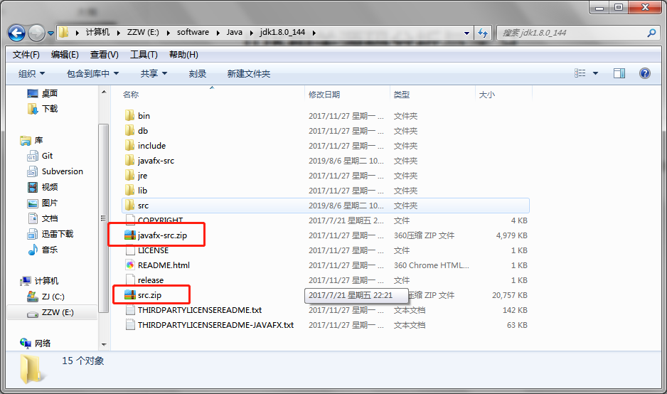

# JDK相关源码分析与学习
### 说明

- 本文档在进行源码分析时，会将具体的 jdk 版本号说明出来，如有小伙伴发现本文档分析的源码与自己的源码不符合时，请及时核对 jdk 版本是否一致

- 本文档中的源码直接导入ide开发工具中会报错（因为有一些 jdk的内部类无法直接引用），建议以下面的方式进行处理。

  - 找到 java 的安装目录，找到 src.zip 和 javafx-src.zip（jdk1.8之后才有）

    

  - 解压这两个压缩包

  - 最后可以用本文档中的源码替换解压的相应文件

  - 最后，如果有不明白的小伙伴欢迎提 issues

### ConcurrentHashMap  jdk1.8.0_144

[ConcurrentHashMap源码](./sources/ConcurrentHashMap.java)

**参考链接**

- [死磕 java集合之ConcurrentHashMap源码分析（一）](https://zhuanlan.zhihu.com/p/62299359)

